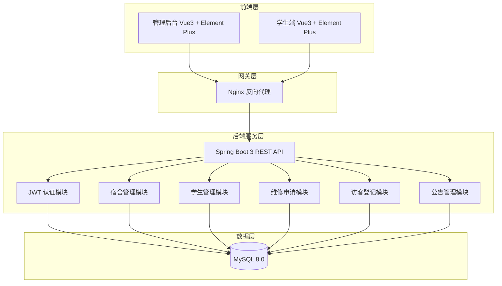
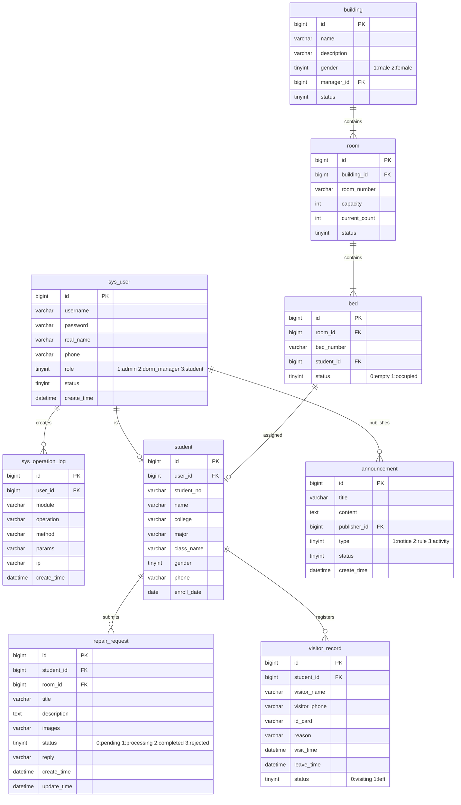

# 宿舍管理系统 - 项目设计文档

## 1. 系统架构



## 2. ER 图



## 3. 接口清单

### 3.1 认证模块 (AuthController)
| Method | Path | Description |
|--------|------|-------------|
| POST | /api/auth/login | 用户登录 |
| POST | /api/auth/logout | 用户登出 |
| GET | /api/auth/info | 获取当前用户信息 |
| PUT | /api/auth/password | 修改密码 |

### 3.2 用户管理 (UserController)
| Method | Path | Description |
|--------|------|-------------|
| GET | /api/users | 分页查询用户 |
| POST | /api/users | 新增用户 |
| PUT | /api/users/{id} | 修改用户 |
| DELETE | /api/users/{id} | 删除用户 |
| PUT | /api/users/{id}/status | 修改用户状态 |

### 3.3 楼栋管理 (BuildingController)
| Method | Path | Description |
|--------|------|-------------|
| GET | /api/buildings | 分页查询楼栋 |
| GET | /api/buildings/list | 获取楼栋列表(下拉) |
| POST | /api/buildings | 新增楼栋 |
| PUT | /api/buildings/{id} | 修改楼栋 |
| DELETE | /api/buildings/{id} | 删除楼栋 |

### 3.4 房间管理 (RoomController)
| Method | Path | Description |
|--------|------|-------------|
| GET | /api/rooms | 分页查询房间 |
| GET | /api/rooms/{id} | 获取房间详情(含床位) |
| POST | /api/rooms | 新增房间 |
| PUT | /api/rooms/{id} | 修改房间 |
| DELETE | /api/rooms/{id} | 删除房间 |

### 3.5 学生管理 (StudentController)
| Method | Path | Description |
|--------|------|-------------|
| GET | /api/students | 分页查询学生 |
| POST | /api/students | 新增学生 |
| PUT | /api/students/{id} | 修改学生 |
| DELETE | /api/students/{id} | 删除学生 |
| POST | /api/students/{id}/bindBed | 分配床位 |
| POST | /api/students/{id}/unbindBed | 退宿 |

### 3.6 维修申请 (RepairController)
| Method | Path | Description |
|--------|------|-------------|
| GET | /api/repairs | 分页查询维修申请 |
| POST | /api/repairs | 提交维修申请 |
| PUT | /api/repairs/{id}/process | 处理维修申请 |
| GET | /api/repairs/my | 我的维修申请 |

### 3.7 访客登记 (VisitorController)
| Method | Path | Description |
|--------|------|-------------|
| GET | /api/visitors | 分页查询访客记录 |
| POST | /api/visitors | 登记访客 |
| PUT | /api/visitors/{id}/leave | 访客离开 |
| GET | /api/visitors/my | 我的访客记录 |

### 3.8 公告管理 (AnnouncementController)
| Method | Path | Description |
|--------|------|-------------|
| GET | /api/announcements | 分页查询公告 |
| GET | /api/announcements/latest | 获取最新公告 |
| POST | /api/announcements | 发布公告 |
| PUT | /api/announcements/{id} | 修改公告 |
| DELETE | /api/announcements/{id} | 删除公告 |

### 3.9 统计面板 (DashboardController)
| Method | Path | Description |
|--------|------|-------------|
| GET | /api/dashboard/stats | 获取统计数据 |

## 4. UI/UX 规范

### 4.1 色彩系统
```scss
// 主色调
$primary-color: #409EFF;
$primary-light: #79BBFF;
$primary-dark: #337ECC;

// 功能色
$success-color: #67C23A;
$warning-color: #E6A23C;
$danger-color: #F56C6C;
$info-color: #909399;

// 中性色
$text-primary: #303133;
$text-regular: #606266;
$text-secondary: #909399;
$text-placeholder: #C0C4CC;

// 边框色
$border-base: #DCDFE6;
$border-light: #E4E7ED;
$border-lighter: #EBEEF5;

// 背景色
$bg-page: #F5F7FA;
$bg-card: #FFFFFF;
```

### 4.2 间距规范
- 页面边距: 20px
- 卡片内边距: 20px
- 元素间距: 16px
- 紧凑间距: 8px

### 4.3 圆角规范
- 卡片圆角: 8px
- 按钮圆角: 4px
- 输入框圆角: 4px
- 标签圆角: 4px

### 4.4 阴影规范
```scss
$shadow-base: 0 2px 12px 0 rgba(0, 0, 0, 0.1);
$shadow-light: 0 2px 4px 0 rgba(0, 0, 0, 0.05);
```

### 4.5 字体规范
- 标题字号: 18px / 16px / 14px
- 正文字号: 14px
- 辅助字号: 12px
- 字体族: -apple-system, BlinkMacSystemFont, 'Segoe UI', 'PingFang SC', 'Hiragino Sans GB', 'Microsoft YaHei', sans-serif
