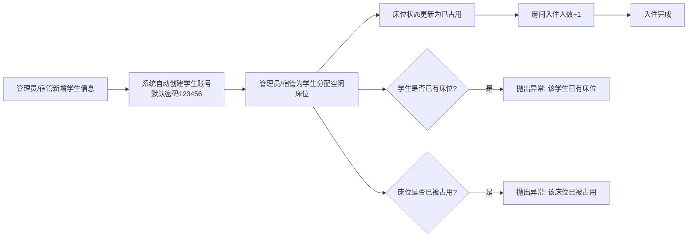
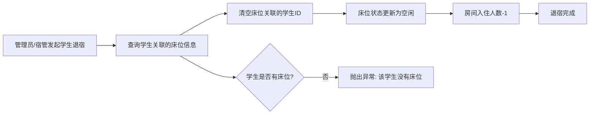
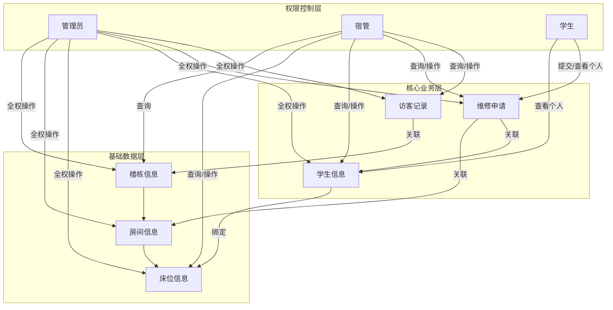

# 宿舍管理系统核心业务闭环与权限体系文档

## 一、系统角色定义
系统包含三类角色，权限完全隔离：
| 角色 | 角色值 | 权限范围 |
|------|--------|----------|
| 管理员 | 1 | 系统最高权限，可操作所有模块 |
| 宿管 | 2 | 可操作学生管理、维修处理、访客登记、数据查询等日常运营功能 |
| 学生 | 3 | 仅可查看个人信息、提交维修申请、查看个人维修记录 |

---

## 二、核心业务闭环：学生入住到退宿全流程
### 2.1 入住与床位分配流程

### 2.2 退宿与床位释放流程

---

## 三、各模块权限隔离与数据流转
### 3.1 楼栋管理模块
| 操作 | 管理员权限 | 宿管权限 | 学生权限 | 数据流转 |
|------|------------|----------|----------|----------|
| 新增/修改/删除楼栋 | ✅ | ❌ | ❌ | 管理员操作后，楼栋信息同步到房间、床位关联数据 |
| 修改楼栋状态 | ✅ | ❌ | ❌ | 楼栋状态变更影响下属房间、床位的可用状态 |
| 查询楼栋列表 | ✅ | ✅ | ❌ | 宿管仅可查询，用于学生分配、维修处理等场景 |
| 房间/床位管理 | ✅ | ✅ | ❌ | 宿管可查看房间入住情况、床位状态，辅助分配管理 |

### 3.2 维修申请模块
| 操作 | 管理员权限 | 宿管权限 | 学生权限 | 数据流转 |
|------|------------|----------|----------|----------|
| 提交维修申请 | ✅ | ✅ | ✅ | 申请人提交后，维修状态为待处理，同步到管理员/宿管待办列表 |
| 查看所有维修申请 | ✅ | ✅ | ❌ | 可按状态筛选，查看全量维修数据 |
| 查看个人维修申请 | ✅ | ✅ | ✅ | 仅查看自己提交的维修记录 |
| 处理维修申请 | ✅ | ✅ | ❌ | 处理后更新维修状态（处理中/已完成），添加处理备注，同步给申请人 |

### 3.3 访客登记模块
| 操作 | 管理员权限 | 宿管权限 | 学生权限 | 数据流转 |
|------|------------|----------|----------|----------|
| 登记访客信息 | ✅ | ✅ | ❌ | 登记访客姓名、身份证、来访事由、来访时间，状态为访问中 |
| 查看所有访客记录 | ✅ | ✅ | ❌ | 可按状态筛选，查看历史和当前访客数据 |
| 登记访客离开 | ✅ | ✅ | ❌ | 更新访客状态为已离开，记录离开时间，完成访客流程 |
| 查看个人访客记录 | ❌ | ❌ | ❌ | 学生无任何访客管理权限 |

---

## 四、数据流转关系总览

---

## 五、系统核心特性
1. **事务一致性**：所有涉及多表修改的操作（如分配床位、退宿、删除学生等）均使用事务保证数据一致性
2. **操作审计**：所有关键操作均记录操作日志，可追溯操作人、操作时间、操作内容
3. **数据隔离**：基于角色注解 `@RequireRole` 实现接口级权限控制，防止越权访问
4. **状态校验**：所有状态变更均有严格校验逻辑，避免非法数据状态产生